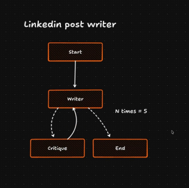

# LinkedIn Post Writer

## About

A high-performance LinkedIn writing assistant built with **Bun**, **TypeScript**, and **Groq** to generate human-like posts tailored for junior developers.
By leveraging **LangChain** and **LangGraph**, the application uses **stateful agents** to handle complex *“revise now”* logic and ensure every draft adheres to specific style constraints such as tone, clarity, and engagement.

---

## 🧠 Architecture Overview



The system follows an iterative agent workflow:

1. **Start** → Initializes the generation process.
2. **Writer Agent** → Produces a LinkedIn draft based on prompt and constraints.
3. **Critique Agent** → Evaluates the draft for tone, structure, and quality.
4. Loop continues **N times (e.g., 5)** until constraints are satisfied.
5. **End** → Outputs the finalized, polished LinkedIn post.

---

## 🚀 Features

* ✍️ Human-like LinkedIn post generation
* 🔁 Iterative “revise-now” feedback loop
* 🧩 Stateful agent orchestration with LangGraph
* ⚡ Ultra-fast runtime using Bun
* 🎯 Style-aware drafting for junior developer audience
* 🧪 Extensible critique & improvement pipeline

---

## 🏗️ Tech Stack

* **Runtime:** Bun
* **Language:** TypeScript
* **LLM Provider:** Groq
* **Frameworks:** LangChain, LangGraph

---

## ⚙️ How It Works

1. User provides a topic or prompt.
2. The **Writer Agent** generates a draft.
3. The **Critique Agent** analyzes the draft against predefined style rules.
4. If constraints aren’t met, feedback is fed back into the Writer.
5. The loop repeats until the draft reaches the desired quality.
6. Final optimized LinkedIn post is returned.

---

## 📦 Installation

```bash
# Install dependencies
bun install

# Run the development server
bun run dev
```

---

## 🤝 Contributing

Contributions are welcome!
Feel free to open issues or submit pull requests to improve the agent logic, prompts, or evaluation strategies.

---

## 📄 License

MIT License © 2026
